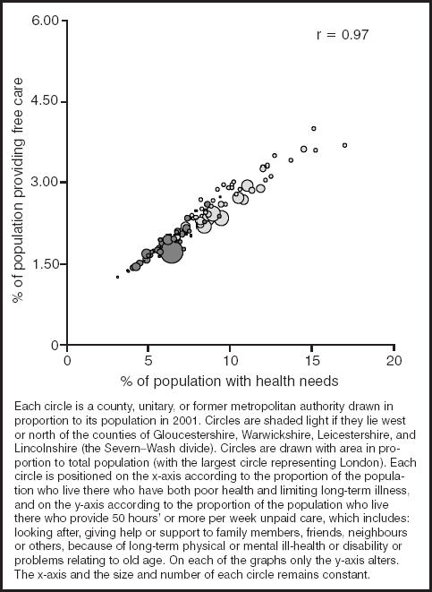

## 1 Using RStudio

Getting Started with RStudio
----------------------------

When you first load up RStudio you will probably get something as
follows:

{width="6.268055555555556in"
height="4.427083333333333in"}

Illustration of Rstudio and its four panes. Top left: Script
pane; Bottom left: I/O pane; Bottom right: figures, help and
documentation; Top right: history and environment

RStudio basically divides the display into four panes. With the
exception of the bottom left pane, each pane contains a number of tabs,
allowing you to switch between the types of information displayed. The
relative size of each pane can be adjusted, and you can minimise and
maximise each pane too. The contents and purpose of each of the four
panes is as follows:

-   **Bottom right**: the Console or I/O (Input/Output) pane. This is
    basically what you saw when you opened up R directly. You can use
    this to work interactively with R, giving it one instruction (input)
    at a time, and getting results (outputs) as a result of
    these instructions.

-   **Top left**: The script window and data viewer. This allows you to
    access, toggle between, and edit a number of script files, which are
    text files containing lots of instructions for passing to the
    R Console. For any serious data management project, you will work
    with and generate scripts, passing script chunks to the console,
    exploring the effects they have once processed by R, and then
    modifying the scripts based on whether or not R did what you wanted
    it to do. Code in the script window looks a bit different to that in
    the console itself, in that it is colour coded according to the
    types of instructions RStudio things it contains, and in general is
    better formatted to be easier for people to understand. By using the
    function View() or similar, you can also create and view datasets in
    this pane, with an SPSS or Excel style look about them.

-   **Top Right**: History and Environment: This pane provides access to
    two tabs: A History tab which contains a list of the log of
    instructions which you have passed to R during its current session;
    and an environment tab showing the objects that exist within the
    current R session. The environment tab allows you to get some
    additional information about some of these R objects using something
    other than the R console.

-   **Bottom Left**: Figures and Help. These pane contains a number of
    tabs, the most important of which are the ‘Plots’ tab, which show
    figures and other images which have been created by R; and ‘Help’,
    which provides information on particular R functions and how to
    use them. It also contains ‘Files’ (self explanatory), Packages,
    which allows downloading of and information about the packages of
    functions which have currently been installed and loaded, and Viewer
    (which I’ve never used).

RStudio Features
----------------

**Exercise**: Go into the ‘global options’ line within the ‘Tools’
dropdown menu within RStudio, then select ‘Appearance’, then the ‘Idle
Fingers’ editor theme. The colour coding described below uses this
theme, but the principle is broader. If you prefer, select a different
theme, or use the default theme.

RStudio offers a number of subtle but important features compared with
accessing R through its native GUI. In particular, the features
available in the script window offer a number of important advantages
over writing the scripts in a simple text editor like notepad or the
script editor included with R. To start to learn both about some of
these features, and about R as a programming language, let’s look at the
following figure:

{width="6.268055555555556in"
height="6.684722222222222in"}

Example of an R script in the RStudio console

One of the first things to note is that different parts of the text are
coloured in different ways. These colours aren’t put in manually by the
user, by generated automatically by RStudio, as it recognises different
parts of the text as specifying different types of information for the R
Console. Some examples:

-   **Light orange** (lines 1, 2, 4, 17, 25): These are comments, which
    R ignores, and written by the user to help them and other users
    understand the code better. Comments are distinguished from commands
    with the \# (hash) symbol. The R console knows to ignore any text to
    the right of this symbols. (This means you can put a comment on the
    same line as an instruction, with the instruction on the left, the
    comment on the right, and the \# symbol separating the two.)

-   **Dark orange** (most lines 9-27): These are some of the functions
    contained in ‘Base R’, the functions that are an integral part of
    the R language. The function shown here is the ‘require’ function,
    which loads R packages, containing additional functions, into the
    current R environment.

-   **Green** (lines 30 onwards): These are ‘string’ objects. Strings
    are technically vectors of character objects, but more intuitively
    ‘chunks’ of text. The distinction between string and other objects
    is subtle but important.

-   **Blue** (throughout): These include symbols like parentheses (),
    the assignment operator &lt;-, the pipe operator %&gt;%, and
    simple (‘unpaired’) values (10, 50, 90, etc). Apart from the simple
    values, these symbols can be best thought of as being like
    conjunctions (‘and’, ‘with’, ‘and then’ etc) in sentences, with the
    roles of joining and connecting statements together.

-   **White** (throughout): These pieces of the text are objects and
    non-base functions. They are the equivalent to nouns and verbs in
    sentences: ‘things’ and ‘stuff that gets done to things’. Just as in
    English, where nouns can get turned to verbs (e.g. ‘crawfished’, to
    use a Bushism), and verbs can get turned into nouns (e.g. ‘decide’
    to ‘decision’), there’s a similar kind of mutability in the R
    language, hence the same colour being applied to both parts of
    the text.

**Exercise**: Create an R script and write out some of the lines in
the script above, noting how different parts of the code are highlighted
in different ways. If a different colour scheme has been used, work out
which text colours indicate which parts of the code. (objects,
operators, strings, comments, and so on.) Alternatively, look through
the code snippet example presented in Tools -&gt; Options -&gt;
Appearance -&gt; Editor theme, and how this changes when different
themes are selected.

Autocomplete features 
----------------------

Most of the features in the script pane are only apparent when writing
in the pane. For example, if you type

rm(

Into the script, RStudio automatically adds a right parentheses

rm()

Because it knows that this particular piece of text refers to a function
rather than an object, and functions need to have an open parentheses
‘(‘at the start and a closed parentheses‘)’ at the end. If your cursor
(indicated with a vertical line ‘|’ ) is located in the middle of this
function, immediately after the left parentheses, and you press the tab
button, the following drop-down list opens up

{width="5.859234470691163in"
height="1.7916666666666667in"}

The purple items in the list are known as the **arguments** to the
function, which modify the function’s behaviour. The yellow items in the
list are objects found in the current R environment. These are things
that you might want to pass to the function.

You can also see the yellow box to the right of the drop down list. This
contains extra information on the particular highlighted item.

**Exercise**: Reproduce the in-text drop-down list shown above.

Another useful feature is name autocomplete. For example I can create an
object, with a very long name, containing a value, as follows:

this\_is\_a\_very\_long\_name\_that\_i\_have\_decided\_to\_use\_because\_i\_really\_like\_typing\_for\_the\_sake\_of\_it
&lt;- 2

Here I have created an object with a very long name, which just contains
(has been assigned, using the assignment operator &lt;- ) the value 2.
After creating this object, I can type the first bit of the name, then
press ‘tab’, and I get a drop-down menu:

{width="7.148187882764654in"
height="0.9083333333333333in"}

Rstudio knows that there are two possible objects in the workspace that
I might be referring to, this\_data and the object with the very long
name I’ve just created. I can use the arrow keys to select between these
objects, then press tab, and the rest of the object name is
automatically filled in. This little feature can be very important for
two reasons: firstly it allows you to use long object names, which can
be more helpful for helping to describe the code, without being
penalised as much in terms of time spent typing. Secondly, it greatly
reduces the risk of typos. If you mis-type something in R, it will think
you are referring to a completely different object, either creating an
object by accident (leading to errors occurring later in the code), or
not finding the object you are referring to (leading to an error at this
point in the code).

It is very important to note that R is CASE SENSITIVE, meaning that, for
example, this\_object and This\_object are thought to be completely
different objects. Similarly, this\_object and this.object refer to
distinct objects. Consistent object naming conventions are therefore
important for minimising the risks of code not working because of these
distinctions. Hadley Wickham (much discussed later) recommends sticking
to a convention of only using lower case characters, and separating
words within object names using the underscore \_ symbol rather than
anything else. Finally, it is important to be aware that, with one
exception,[^2] the objects should contain no spaces: this\_object is
recognised as one object, but this object is thought to be two objects,
this and object, and will produce an error as you have not specified how
this and object should relate to each other.

**Exercise**: Produce two objects, one with a long name, the other
with a short name, and whose names both start with the same characters,
and use the drop-down menu to choose between them. Assign the value of
one of the objects to the other object, and delete one or both objects.


## 2 Manipulating data

In this section we will look at manipulating data with the dplyr package. dplyr is designed to simplify and standardise data manipulation in R. It has grown out of extensive research into how people actually manipulate data.

Even very experienced R users, and I started using R in 2008, have moved over to dplyr for its several advantages; it is incredibly fast, consistent and easy to use. One of the consistencies is brought about by the use of tibbles. tibbles are essentially dataframes with stricter rules about converting between types of objects, and better default printing options.

We will work through a typical ISD problem using dplyr consulting the RStudio cheatsheet on "Data Transformation with dplyr" (https://www.rstudio.com/resources/cheatsheets/). Before that, it is important to cover a few key concepts.

### 1. dplyr works at the dataframe (not the vector) level.

This might seem like a move back to SPSS-type approaches, and in some ways it is. dplyr gives the advantages of a very simple interface for much data manipulation work, but with modern consitent approaches and a tight integration with R's wider functionality. 

### 2. Each data manipultion action is represented as a dplyr function.

```{r, eval = FALSE}
filter() (and slice()) # choose rows
arrange() # order rows
select() (and rename()) # choose/rename columns
distinct() # select distinct rows
mutate() (and transmute()) # add columns (without/with dropping existing columns)
summarise() # summarise results using some aggregating function
sample_n() (and sample_frac()) # take a random sample of a dataframe
```

### 3. Chaining

Which of these three versions of code is easier to follow:-

Intermediate step code
```{r, eval = FALSE}
a1 <- group_by(flights, year, month, day)
a2 <- select(a1, arr_delay, dep_delay)
a3 <- summarise(a2,
  arr = mean(arr_delay, na.rm = TRUE),
  dep = mean(dep_delay, na.rm = TRUE))
a4 <- filter(a3, arr > 30 | dep > 30)
```

Nested function code
```{r, eval = FALSE}
filter(
  summarise(
    select(
      group_by(flights, year, month, day),
      arr_delay, dep_delay
    ),
    arr = mean(arr_delay, na.rm = TRUE),
    dep = mean(dep_delay, na.rm = TRUE)
  ),
  arr > 30 | dep > 30
)
```

Chained function code
```{r, eval = FALSE}

flights %>%
  group_by(year, month, day) %>%
  select(arr_delay, dep_delay) %>%
  summarise(
    arr = mean(arr_delay, na.rm = TRUE),
    dep = mean(dep_delay, na.rm = TRUE)
  ) %>%
  filter(arr > 30 | dep > 30)
```

The latter uses pipes **%>%**. Pipes allow you some of the advantages of a step-by-step type interface such as is used in SPSS within an object-based language like R. The pipe is an "infix" function  It is therefore of the form `a` *function* `b` (examples of infix functions are +, -, / *, ^). The pipe takes whatever object came before it and "pipes" it to the first slot of the function coming afterwards. In other words, the following are equivalent.
```{r, eval = FALSE}
f(x, y)
x %>% f(y)
```

One last thing about dplyr. It uses non-standard evaluation. Most R functions require the \$ operator to use vectors within dataframes (eg `mean(mydf$x)`). dplyr uses non-standard evaluation (NSE), which avoids this. NSE reduces typing; but also allows dplyr code to be automatically translated into SQL. This means that dplyr code can be used to query databases such as the data warehouse at ISD. Special forms of the dplyr functions exist for use with user-defined functions.

## The problem

You have received an urgent information request. Some people are concerned that some environmental exposure in Lothian is increasing the rate of childhood Leukaemia. You have been asked to respond; specifically you have to:-

1. Calculate the number and rate of childhood leukaemia in Lothian and other health Boards
2. Summarise this graphically and in tables, and compare the Lothian rates to other regions in Scotland.

Open up the script. Childhood Leukaemia, and work through the exercises below.

**Exercise**:
See script leukaemia.R

1. Load the data. Examine each table to understand the structure.
2. Run each section of code. Make sure you understand the pipe operator **%>%** and what each line of code is doing.
3. Modify the first section of code so that only codes in positions 1 or 2 are included.
4. Modify the code so that only first episodes are included.
5. Why did I use the dplyr if_else() function rather than the base R ifelse() function?
6. Exclude Fife data from the Rest of Scotland versus Lothian comparison
7. Count the total number of deaths within 30 days of discharge following an incident admission with leukaemia and calculate the 30-day case fatality proportion. Then aggregate this by health board and sex 


# Messy data and tidy data with Tidyr

**Exercise**:
see script waiting times.R

1. Run the code. Make sure that you have an idea of what each line does by running it.
2. In what ways are this data messy?
3. Why is it important to move rownames to the datafraem itself?
4. Pick a version of your team's datasets that is not tidy. Consider how you would make it tidy.

# Data visualisation
Data Visualisation using ggplot2
--------------------------------

ggplot2 is Hadley Wickham’s most popular R package. It is designed for
data visualisation. In ggplot2 the + operator behaves somewhat like the
%&gt;% operator does within dplyr and tidyr. However, order is
irrelevant for ggplot2. Also, ggplot2 draws from a different paradigm, a
way of thinking about and being explicit about the production of data
graphics known as the ‘grammar of graphics’, based on a book of this
name by the statistician Leland Wilkinson. A large number of
introductions exist to ggplot2, but at its core the grammar of graphics
approach is about providing a language for clearly defining *the mapping
rules which link values in columns in a data frame to features on a
graphical display*. Conceptually, this can be thought about as kind of
‘box wiring’ exercise, with data frame columns at one side of the box,
and graphical features on the other end of the box. An example of this
is shown below:

{width="6.268055555555556in"
height="1.8055555555555556in"}

In this example the data frame, on the left, can be thought to contain
four columns, and the values in each of these columns are ‘wired’ to so
they control a different part of the graphic displayed. At a minimum,
within ggplot2 the user needs to specify:

-   The dataset which contains the variables

-   The mapping rules, known as ***aes***thetics, which define how the
    values of the variables control different parts of the graphic

-   The ***geom***etrics: the type of graphic element that is displayed

An illustration of how the above set of mapping rules may look within
ggplot2 is as follows:

```{r, eval = FALSE}
ggplot2(dta, aes(x = health_care_records,y = health_care_provision, size = population_size, fill = is_north)) +
  geom_point()

```

-   This aes function defines the mapping rules indicated by the box wiring above.

    -   x = health\_care\_needs : the horizontal position of the points
        is determined by the value of rows in the health\_care\_needs
        column

    -   y = health\_care\_provision : the vertical position of the
        points is determined by the value of the rows in the
        health\_care\_provision column

    -   size = population\_size: the size of the points is determined by
        the value of the rows in the population\_size column. (This
        effectively turns points into bubbles, and hence is why there is
        no separate geom\_bubble function.)

    -   fill = is\_north: the colour or shade within the point/bubble is
        determined by the value of the rows in the is\_north column.

The above example is based on the main figure in a 2004 paper by Mary
Shaw and Danny Dorling[^1], reproduced below, along with the notes
presented below that figure:


{width="4.441666666666666in" height="2.0790616797900263in"}


This figure was very likely produced in Excel. The grammar of graphics
paradigm is largely independent of any particular statistical package or
programming language, even though the ggplot2 package is specific to R.

**ggplot2: Cheat Sheet, Websites and Books**

For ggplot2, the standard R help files are often less useful than for
many other functions and packages, mainly because the concepts and ideas
are so inherently visual, whereas the help files are text files. Instead
the official website is generally a much more effective resource for
learning about ggplot2 in action:

<http://docs.ggplot2.org/0.9.3.1/index.html>

Like the data wrangling cheat sheet, Rstudio have produced a Cheat Sheet
for data visualisation using ggplot2:

**Exercise:** Explore and discuss the cheat sheet and website with other
attendees.

As suggested by its smaller font size and increased number of columns,
the data visualisation cheat sheet contains more content than the data
wrangling cheat sheet, not least because ggplot2 is an older, better
developed and more complex package than dplyr and tidyr, and so requires
more knowledge and experience to use properly. An extremely good book
for using ggplot2 is Hadley Wickham’s own ggplot2 book (second edition)

[^1]: Shaw M & Dorling D (2004) “Who cares in England and Wales? The
    Positive Care Law: cross-sectional study” *British Journal of
    General Practice*, 54 (509): 899-903

