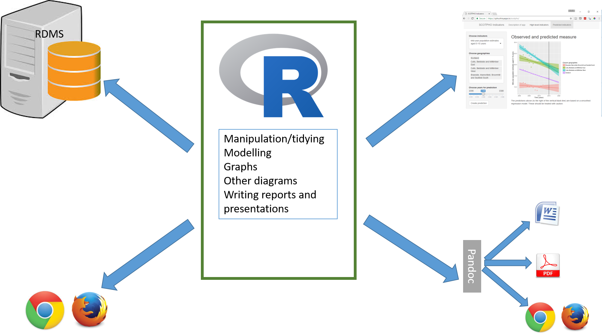
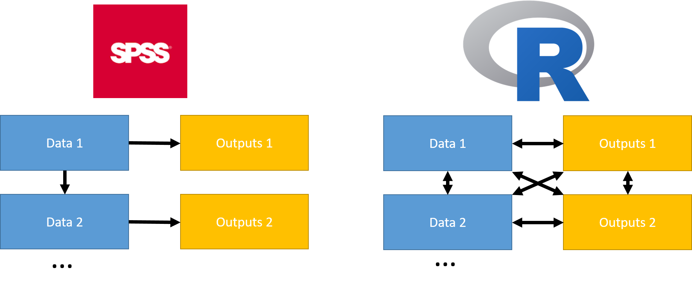

```{r setup, include=FALSE}
library(tidyverse)
knitr::opts_chunk$set(echo = TRUE)
```

## Learning objectives

Preliminaries

- Understand the pros and cons of R
- Understand how to use RStudio efficiently
- Learn about resources to support use of R

Data Management

- Understand the concepts of tidy (canonical) data
- Gain some experience of using the new tidyr and dplyr packages
- Understand how to use dplyr with a relational database

Visualisation

- Understand the Grammar of Graphics and try out ggplot2

## Style of course

* Go through a workbook together
  + Reading
  + Discussions
  + Running and writing some R code

# What can R do

## 
```{r, out.width = "1000px", echo = FALSE}

```

# Differences between R and SPSS

## The FIVE PARTS of SPSS

1. Data input and management statements
2. Statistical and graphical procedures
3. An output management system
4. A macro language to help automate
5. A matrix language to add new algorithms (SPSS Matrix)

From Bob Muenchen

## R does all of this with functions and objects

```{r, eval=FALSE}
mydf <- read_csv (file = "some file name.csv") # 1. reads in csv files
mymod <- lm(y ~ x, data = mymod) # 2. creates a linear model
mycoefs <- coef(mymod) # 2/3. takes the coefficients from the model
pdf("fig_name.pdf") # 3. saves a plot of the model diagnostics
plot(mymod)
dev.off()
write_csv(mycoefs, path = "file_name.csv") # 3. write the results to a file
```

# Working with functions and objects

## What is a function
```{r}
identity(1)
```

- Takes input(s) - arguments
- Returns a **single object** - value
- May produce side effects
- Self contained

## Passing arguments to functions

* Arguments to functions are matched by R on
    * position, eg `lm (y ~ x, mydata)` 
    * name, eg `lm ( formula = y ~ x, data = mydata)`
    * partial name, eg `lm (form = y ~ x, dat = mydata)`
* name trumps position
* Default values are often used ` mean(x, trim = 0, na.rm = FALSE, ...) `
* Defaults can be other arguments `factor (x = character(), levels, labels = levels)`

## An aside about readable code
```{r, eval = FALSE}
args(glm)
model1 <- glm (formula = "speed ~ dist", family = gaussian, data = cars) # overkill
model1 <- glm (speed ~ dist, data = cars) # about right
model1 <- glm (speed ~ dist, , cars) # awful
```
Use argument name for anything past first or second argument

## Assigning functions to objects

In Stata, SPSS, SAS
```{}
select if x ge 9.
exe.
```

In R
```{r}
mydf <- tibble(x = 1:10, a = "some_text")
filter(mydf, x >=9)
mydf
```

Need to assign to an object
```{r}
mydf <- filter(mydf, x >=9)
mydf
```

## Different workflow

```{r, out.width = "1000px", echo = FALSE}

```

## Flexibility; strength and a challenge

- RStudio Integrated Development Environment
- The tidyverse, dplyr and tidyr - data manipulation

# Exercise 1, using R studio

# Project managment in Rstudio
Fire-up Rstudio and show example

# Exercise 2, using dplyr

# Tidy data

## The tidy data paradigm
Wickham’s article on tidy data, called simply ‘Tidy Data’, is available from the following location:
http://vita.had.co.nz/papers/tidy-data.pdf. Or we have the vignette ftp://cran.r-project.org/pub/R/web/packages/tidyr/vignettes/tidy-data.html

Wickham argues that, in tidy data:
1.	Each variable forms a column
2.	Each observation forms a row
3.	Each type of observational unit forms a table 

## Advantages of tidy data

* concentrate on problem
* easier communication/team working
* critical mass

## Most data are "messy"
* Column headers are values, not variable names.
* Multiple variables are stored in one column.
* Variables are stored in both rows and columns.
* Multiple types of observational units are stored in the same table.
* A single observational unit is stored in multiple tables.

## Column headers are values, not variable names.
```{r, echo = FALSE}
tribble(
  ~"region", ~"31-Mar-08", ~"30-Jun-08", ~"30-Sep-08",
1,53303,50357,50363,
2,23245,123,879,
3,234,10,5000
)
```

## Multiple variables are stored in one column.
```{r, echo = FALSE}
tb <- read_csv("../data/tb.csv")
tb
```

```{r}
 tb %>% 
  gather(demo, n, -iso2, -year, na.rm = TRUE) %>% 
  separate(demo, c("sex", "age"), 1)
```
## Variables are stored in both rows and columns.
```{r, echo = FALSE}
weather <- read_csv("../data/weather.csv")
weather
```

```{r, echo = FALSE}
 weather %>% 
  gather(day, value, d1:d7, na.rm = TRUE) %>% 
   mutate(day = extract_numeric(day)) %>%
  select(id, year, month, day, element, value) %>%
  arrange(id, year, month, day) %>% 
  spread(element, value)
```


## Three actions

* gather
* spread
* separate

# Exercise - Fixing messy waiting list data