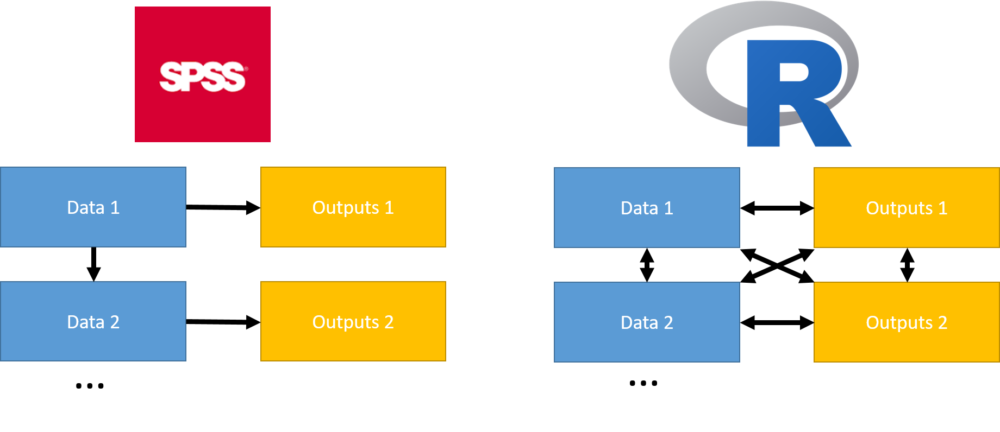

```{r setup, include=FALSE}
library(tidyverse)
knitr::opts_chunk$set(echo = TRUE, warning = FALSE, message = FALSE)
```

# Acknowledgments

Previous attendees
Hadley Wickham
Jon Minton (Rstudio, ggplot2)

# Aims and objectives 

To make R a useful tool for you in your work at ISD

  - Use the benefits of RStudio for efficient working
  - Be ready to introduce dplyr and tidyr to your data work
  - Understand the role of functions and the apply family
  - Understand the paradigm of ggplot2 in data visualisation
  - Consider the use of tools for dissemination such as Shiny and knitr/rmarkdown

# Topics

- Working in R and RStudio
- Tidying data with dplyr and tidyr
- Using functions and apply functions to work efficiently
- Data visualisation
- Getting results out - shiny and 

# Style of course

- Presentations
- Demonstrations
- Run and modify example code
- Responsive

# What can R do

```{r, out.width = "1000px", echo = FALSE}
knitr::include_graphics("../images/workflow.png")
```

# Differences between R and SPSS

## The FIVE PARTS of SPSS

1. Data input and management statements
2. Statistical and graphical procedures
3. An output management system
4. A macro language to help automate
5. A matrix language to add new algorithms (SPSS Matrix)

From Bob Muenchen

# R does all of these with one language

"Everything in R is an object, everything that happens is a function call". John Chambers.

```{r, eval=FALSE}
mydf <- read_csv (file = "some file name.csv") # 1. reads in csv files
mymod <- lm(y ~ x, data = mymod) # 2. creates a linear model
mycoefs <- coef(mymod) # 2/3. takes the coefficients from the model
pdf("fig_name.pdf") # 3. saves a plot of the model diagnostics
plot(mymod)
dev.off()
write_csv(mycoefs, path = "file_name.csv") # 3. write the results to a file
```

# A brief introduction to objects and functions

# What is an object

From the manual - specialized data structures

For our purposes - named entities in the workspace

# What is a function

```{r}
identity(1)
```

- Takes input(s) - arguments
- Returns a **single object** - value
- May produce side effects
- Self contained

# Passing arguments to functions

* Arguments to functions are matched by R on
    * position, eg `lm (y ~ x, mydata)` 
    * name, eg `lm ( formula = y ~ x, data = mydata)`
    * partial name, eg `lm (form = y ~ x, dat = mydata)`
* name trumps position
* Default values are often used ` mean(x, trim = 0, na.rm = FALSE, ...) `
* Defaults can be other arguments `factor (x = character(), levels, labels = levels)`

# An aside about readable code
```{r, eval = FALSE}
args(glm)
model1 <- glm (formula = "speed ~ dist", family = gaussian, data = cars) # overkill
model1 <- glm (speed ~ dist, data = cars) # about right
model1 <- glm (speed ~ dist, , cars) # awful
```
Use argument name for anything past first or second argument

# Functions and objects together

In Stata, SPSS, SAS
```{}
select if x ge 9.
exe.
```

In R
```{r}
mydf <- tibble(x = 1:10, a = "some_text")
filter(mydf, x >=9)
mydf
```

Need to assign to an object
```{r}
mydf <- filter(mydf, x >=9)
mydf
```

Or modify an existing object
```{r}
mydf$newvar <- mydf$x * 5
str(mydf)
```


# More complex workflow

```{r, out.width = "1000px", echo = FALSE}

```

# Flexibility; strength and a challenge

Recent changes to attentuate the difficulty

- RStudio Integrated Development Environment
- The tidyverse, dplyr and tidyr - data manipulation

# Exercise, using R studio

Please see the PHI course exercises.

# Project managment in Rstudio

- the working directory
- standard folder names
- everything done with code
- version control

# Exercise, using dplyr

Please see the PHI course exercises.

# Tidy data

# The tidy data paradigm
Wickham’s article on tidy data, called simply ‘Tidy Data’, is available from the following location:
http://vita.had.co.nz/papers/tidy-data.pdf. Or we have the vignette ftp://cran.r-project.org/pub/R/web/packages/tidyr/vignettes/tidy-data.html

Wickham argues that, in tidy data:

1.	Each variable forms a column
2.	Each observation forms a row
3.	Each type of observational unit forms a table 

# Advantages of tidy data

* concentrate on problem
* easier communication/team working
* critical mass

# Most data are "messy"

* Column headers are values, not variable names.
* Multiple variables are stored in one column.
* Variables are stored in both rows and columns.
* Multiple types of observational units are stored in the same table.
* A single observational unit is stored in multiple tables.

# Column headers are values, not variable names.

```{r, echo = FALSE}
tribble(
  ~"region", ~"31-Mar-08", ~"30-Jun-08", ~"30-Sep-08",
1,53303,50357,50363,
2,23245,123,879,
3,234,10,5000
)
```

# Multiple variables are stored in one column.

```{r, echo = FALSE}
tb <- read_csv("../data/tb.csv")
tb
```

```{r}
 tb %>% 
  gather(demo, n, -iso2, -year, na.rm = TRUE) %>% 
  separate(demo, c("sex", "age"), 1)
```
# Variables are stored in both rows and columns.

```{r, echo = FALSE}
weather <- read_csv("../data/weather.csv")
weather
```

```{r, echo = FALSE}
 weather %>% 
  gather(day, value, d1:d7, na.rm = TRUE) %>% 
   mutate(day = extract_numeric(day)) %>%
  select(id, year, month, day, element, value) %>%
  arrange(id, year, month, day) %>% 
  spread(element, value)
```


# Three actions can be used to tidy most data

* gather
* spread
* separate

# Exercise - Tidy messy data

Please see PHI Course Exercise.

# Automating work - user-defined functions and list-functions

# Functions, advantages

* updateable
* transferable
* testable
* self-contained

# When to use

Whenever you cut and paste more than twice.

# Example of a function

```{r}
df <- tibble::tibble(
  a = rnorm(10),
  b = rnorm(10),
  c = rnorm(10),
  d = rnorm(10)
)

df$a <- (df$a - min(df$a, na.rm = TRUE)) / 
  (max(df$a, na.rm = TRUE) - min(df$a, na.rm = TRUE))
df$b <- (df$b - min(df$b, na.rm = TRUE)) / 
  (max(df$b, na.rm = TRUE) - min(df$a, na.rm = TRUE))
df$c <- (df$c - min(df$c, na.rm = TRUE)) / 
  (max(df$c, na.rm = TRUE) - min(df$c, na.rm = TRUE))
df$d <- (df$d - min(df$d, na.rm = TRUE)) / 
  (max(df$d, na.rm = TRUE) - min(df$d, na.rm = TRUE))
```

```{r}
rescale01 <- function(x) {
  rng <- range(x, na.rm = TRUE)
  (x - rng[1]) / (rng[2] - rng[1])
}
rescale01(c(0, 5, 10))
```

# Creating a function

1.  Pick a __name__ for the function
  - use a verb
  - make it descriptive
  - use consistent names
  - avoid common existing function names

2.  List the inputs, or __arguments__, to the function inside `function`.
    Here we have just one argument. If we had more the call would look like
    `function(x, y, z)`.

3.  Place code you have developed iteratively in __body__ of the function, a 
    `{` block that immediately follows `function(...)`.
    
    
# Apply(ing functions)


## Use apply family of functions to avoid looping

* lapply - apply functions to lists
* sapply - a wrapper for lapply which simplifies the output as much as possible
* tapply - apply to a dataframe (generally) split by a factor
* apply - apply across rows and/or columns of a matrix-like object
* others like by, aggregate etc, but I don't use because I prefer dplyr. However, we will use `by` in the next but one exercise

## Why 
* Makes code more readable
* It is not faster
* Makes code more transferrable, takes care of looping

# lapply and sapply

## lapply returns lists
```{r,}
cars %>%  head()
# Works on a list and returns a list
lapply (list(a = 1:3, b = 20:25), mean)
# sapply similar, but "s"implifies to a vector or matrix 
sapply (list(a = 1:3, b = 20:25), range)
```

# Applying functions within dataframes
For creating new vectors in a tibble, taking a single column argument mutate_at, mutate_all, summarise_at and summarise_all are easier to use in a tidy data context.
```{r}
cars %>% summarise_all(mean)
```

```{r}
cars %>% summarise_at(vars(speed), mean)
```

```{r}
cars %>% mutate_all(funs(. - mean(.)))
```

# For more complex functions, map can be used

like `lapply()` `map()` takes a list and applies a function to it.

```{r, eval = FALSE}
my_list <- list(a = 1:3, b = c("char1", "char2"))
# Exactly the same as lapply
map(my_list, function(x) paste(class(x), length(x), sep = ", "))
# A short-hand form for supplying the function
map(my_list, ~ paste(class(.x), length(.x), sep = ", "))

```

# Why use purrr::map

* similar to lapply
* generalise over 2, 3 or more lists `map2()` and `pmap()`
* can enforce certain types of output `map_int()`, `map_lgl`

# Examples of functions, with .apply/map in action

- Working with multiple similar data structures

- Performing multiple analyses; eg regression models

- Performing different data manipulation; eg extracting data for different ICD-10 codes

# Dissemination of results

# RMarkdown

```{r, out.width = "1000px", echo = FALSE}

```

- Demonstration of shiny

# The help menu

- Demonstration and discussion